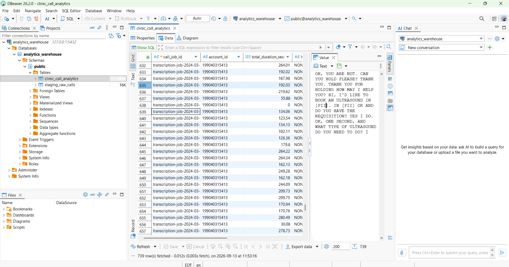

# ETL Pipeline Architecture (Pseudocode)

## Objective
Dynamically read local directory trees to 'Extract' raw, unstructured AWS Transcribe medical clinic call files, execute JSONB 'Transformations' to build a warehouse layer, and write them into a Docker-containerized PostgreSQL environment, where they would be 'Loaded'.

DBeaver was used to visualize the cleaned table with readable transcriptions. 

---

## Metrics
* **File Volume:** **739 nested AWS Transcribe data tokens** split into multiple subdirectories.
* **Processing Speed:** The engine executes the full cycle—Extraction, Transform, Load—in **approximately 4.75s**!

---

## Pseudocode

    Pipeline START
    1.  READ command-line arguments to resolve environment execution flag ('dev' or 'prod')
        IMPORT DB_DETAILS parameters from secure configuration module
        ESTABLISH connection channel to containerized PostgreSQL Target Warehouse
        INITIALIZE database network communication cursor

    2.  EXECUTE SQL: "CREATE TABLE IF NOT EXISTS staging_raw_calls..."
        EXECUTE SQL: "CREATE TABLE IF NOT EXISTS clinic_call_analytics..."
        COMMIT schema transaction to lock structure definitions
        PRINT stage verification message 

    3. 'EXTRACT'
        DEFINE root target directory as 'data/'
        PRINT message for active directory scan
        EXECUTE recursive directory search for pattern: 'data/**/*.json'
        STORE all discovered file paths in a target array list
        PRINT standard message for successfully finding __ number of file footprints
        IF target array list is empty THEN
            CLOSE database connection
            TERMINATE pipeline exe
        ENDIF

        INITIALIZE master raw 'payloads' (data) array list
    
    4. RAW PAYLOADS LOOP
        FOR each file path in discovered target array list:
            OPEN file with read-only permissions and UTF-8 encoding
            PARSE raw content characters into a Python dictionary object
            IF succeeds THEN
                APPEND raw dictionary object to master payloads array list
            ENDIF
        ENDFOR
    
    5. STAGING
        IF master raw payloads array list is NOT empty THEN
            CAPTURE pipeline start stopwatch
            
            CONVERT Python dictionary entries back to flat JSON text strings
            EXECUTE parameterized batch bulk insert statement into 'staging_raw_calls' table
            COMMIT database transaction state
            
            PRINT standard message for dumping JSON chunks (blobs) into staging area
    
    6. ANALYTICAL 'TRANSFORMATION' (PostgreSQL SQL code)
            PRINT message for executing SQL query
            
            EXECUTE SQL: 
                INSERT INTO clinic_call_analytics
                SELECT 
                    Added (9/12/2026): Top-Level Keys Found: ['jobName', 'accountId', 'isRedacted', 'status', 'results']
                    Extract top-level 'jobName' text as unique key,
                    Extract top-level 'accountId' text string,
                    Calculate duration math as 'end_time' and 'start_time',
                    Evaluate 'transcript' string text via pattern matching to trace automated phone messages,
                    Standardize, trim, capitalize, and truncate text transcripts
                FROM staging_raw_calls
                ON CONFLICT (call_job_id) DO UPDATE...
                
            EXECUTE SQL: "TRUNCATE TABLE staging_raw_calls;" 
            COMMIT database transformation 
            
            CAPTURE pipeline stopwatch end
            CALCULATE math
            
            PRINT standardized message for: successful migration of records in [timestamp (in s)]
        ELSE
            PRINT warning message for incomplete migration (and skip)
        ENDIF
    
    7. CLEANUP PHASE
        CLOSE database cursor communication
        CLOSE PostgreSQL database connection
    Pipeline END